# Custom Shell in C – OS Mini Project

## Overview
This project is an implementation of a `custom UNIX-like shell` written entirely in `C`.  
It supports `built-in commands`, execution of `external programs`, `process control`,  
`I/O redirection`, `background execution`, and `robust signal handling`.

The project fully satisfies all specifications defined in the OS Mini-Project document.

---

## Features Implemented

### 1. Shell Prompt

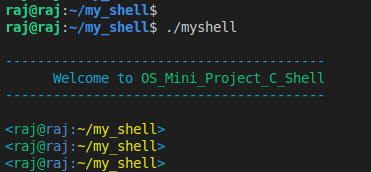

- Displays in the required format:  ``` <username@hostname:current_directory> ```
- Uses `~` to represent the shell’s home directory.
- Dynamically updates as the user changes directories.
- Username and hostname are fetched using system calls (not hardcoded).

---

## 2. Built-in Commands

### **echo**
- Prints arguments separated by a single space.
- Collapses multiple spaces/tabs into one (as required).
- No flags or quotes are processed (per specification).

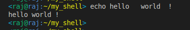

### **pwd**
- Prints absolute path of the current working directory.

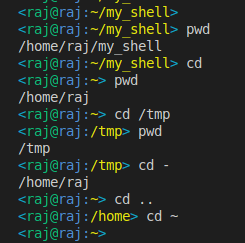

### **cd**
Fully compliant with all required cases:
- `cd` → goes to shell’s home directory.
- `cd ~` → go to home.
- `cd ..` → go one level up.
- `cd -` → go to previous directory and print it.
- `cd <path>` → go to specified path.
- Error handling:
- Too many arguments → prints error.
- Invalid path → prints error.

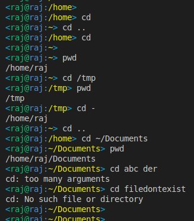

### **history**
- Stores last **20** commands.
- Shows last **10** when `history` is typed.
- Prevents storing consecutive duplicate commands.
- Persistent across sessions using `~/history.txt`.
- Implements circular buffer for overwriting oldest entries.

<p float="left">
  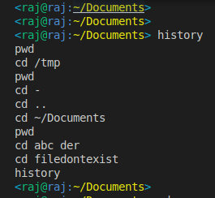
  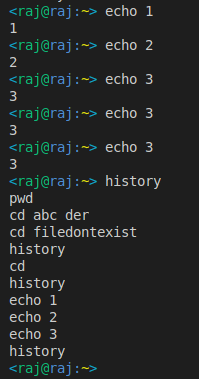
</p>

---

## 3. External Commands & Process Management

### **Foreground Execution**
- Uses `fork()` and `execvp()` to execute external programs.
- Parent waits for child to finish before showing prompt.

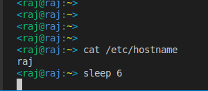


### **Background Execution**
- Commands ending with `&` run in background.
- Shell prints `[bg] started pid <pid>`.
- Does not wait for background processes.


### **I/O Redirection**
- Supports:
- Input: `<`
- Output: `>`
- Combined: `< input.txt > output.txt`
- Uses `open()` and `dup2()` to redirect stdin/stdout before `execvp()`.

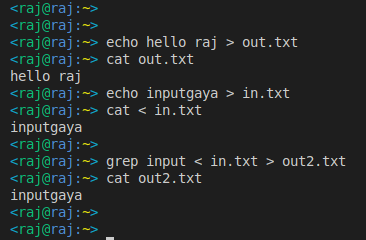
---

## 4. Signal Handling

### **Ctrl+C (SIGINT)**
- Does **not** terminate the shell.
- If a foreground process is running, only that process is terminated.
- Shell continues running normally.

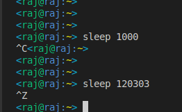

### **Ctrl+Z (SIGTSTP)**
- Shell does **not** stop.
- Foreground child process is suspended.
- Prompt reappears immediately.

### **Ctrl+D**
- Exits the shell cleanly.

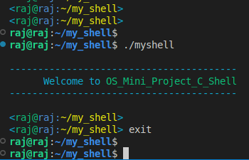


### **SIGCHLD**
- Reaps terminated background processes using a `waitpid()` loop.
- Prevents zombie processes.

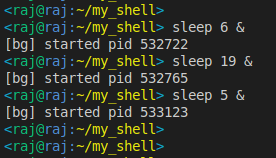
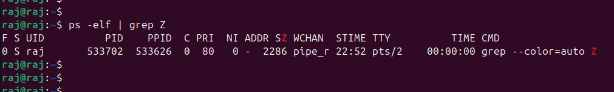

---

## 5. Modularity & Organization
The codebase is modular and cleanly divided:

- `main.c` – main loop, prompt, line handling
- `parser.c` – command parsing, tokenization, redirection detection
- `builtins.c` – echo, cd, pwd, history implementations
- `history.c` – persistent history (20-buffer + last 10 display)
- `execute.c` – fork/exec, redirection, background process handling
- `signals.c` – signal handlers (SIGINT, SIGTSTP, SIGCHLD)
- `headers.h` – shared structures, declarations, includes
- `Makefile` – build and clean targets
- `history.txt` – persistent history file (created in home directory)


---

## How to Compile

Run: ```make```


This generates the `myshell` executable.

To clean build artifacts: `make clean`


---

## How to Run

Start the shell with: `./myshell`


Exit the shell using: `Ctrl+D`  or `exit`

---


---

## Project Status

 
The shell supports built-ins, history persistence, external commands,  
background jobs, I/O redirection, robust signal handling, and a clean modular design.

---


**[PRAKHAR RAJ / 2022102066]**  
Operating Systems Mini Project, 2025  
